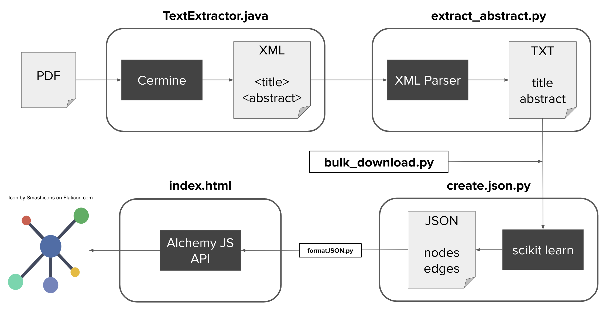
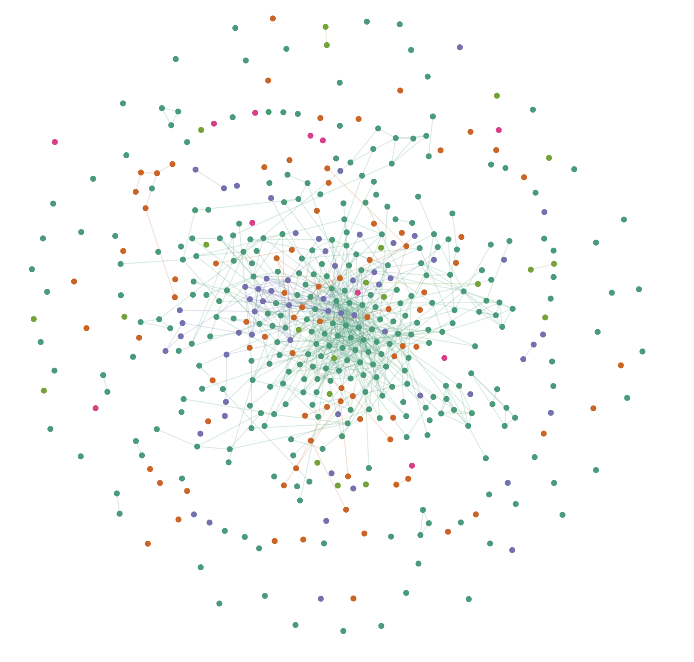
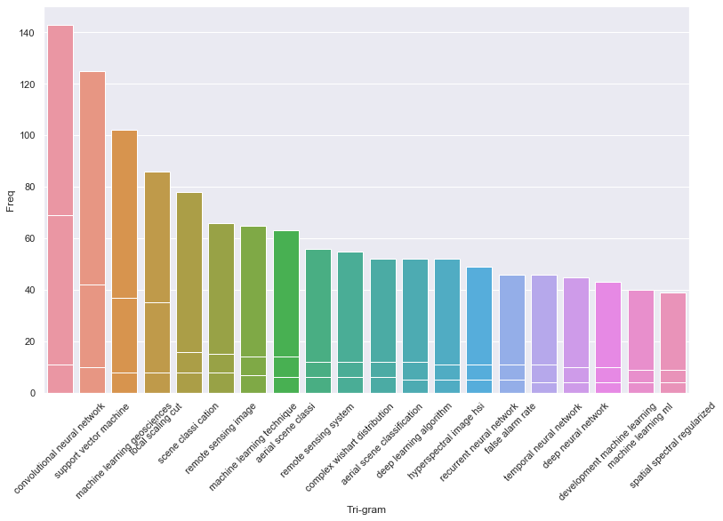
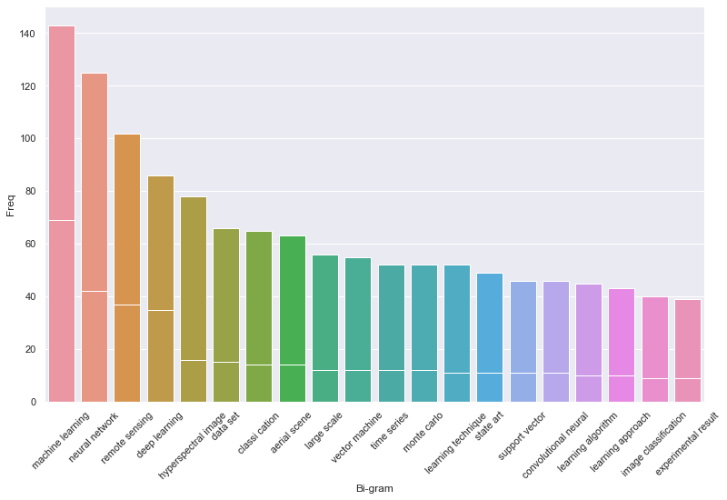
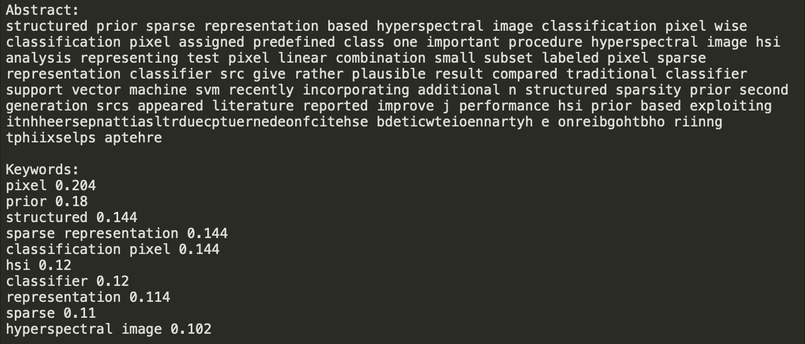
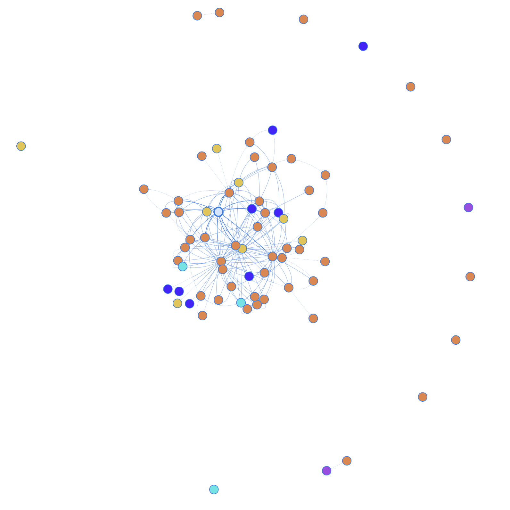
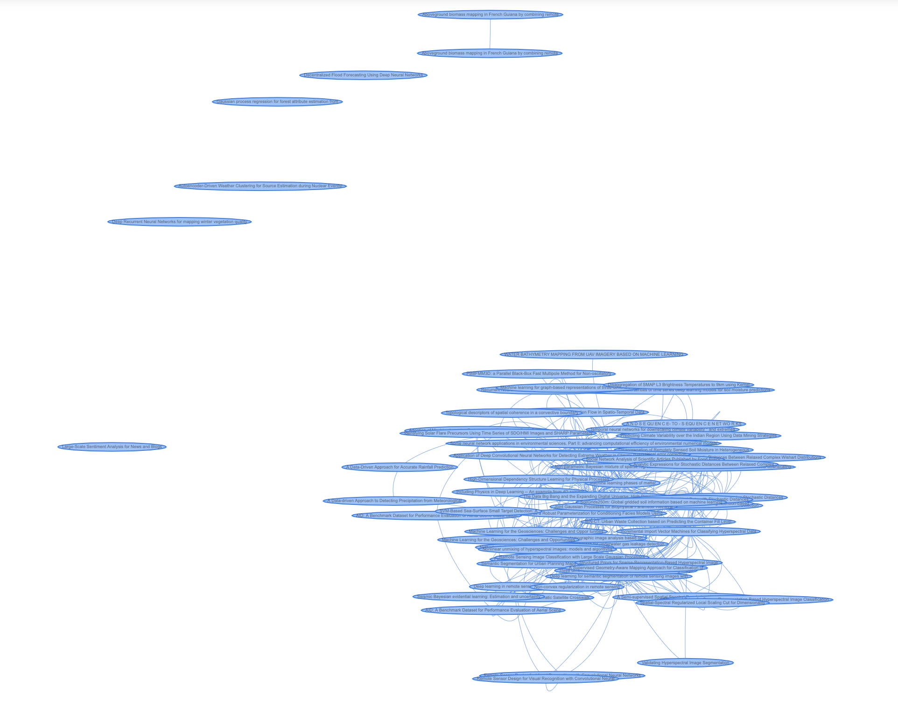

# doc-graph
doc-graph is a network visualization of publications based on their textual similarities.

## Table of Contents
1. [Getting Started](#i.-getting-started)
  * [Overview](#overview)
  * [Running TextExtractor.java](#running-textextractor.java)
  * [Installing Dependences](#installing-dependencies)
2. [File Descriptions](#ii.-file-descriptions)
  * [main.py](#main.py)
  * [text-extractor/src/text-extractor/TextExtractor.java](#text-extractor/src/text-extractor/TextExtractor.java)
  * [extract_abstract.py](#extract_abstract.py)
  * [bulk_download.py](#alternative-to-textextractor-&-extract_abstract:-bulk_download.py)
  * [create_json.py](#create_json.py)
  * [visualiz/index.html](#visualiz/index.html)
3. [Folder Descriptions](#iii.-folder-descriptions)
  * [Papers](#papers)
  * [xml-files](#xml-files)
  * [extracted-text](#extracted-text)
  * [visualiz](#visualiz)
  * [NLP](#nlp)
4. [General Notes](#iv.-general-notes)
5. [Resources for NLP](#v.-resources-for-nlp)
6. [Updates](#vi.-updates)

## I. Getting Started
### Overview



* *Note: TextExtractor.java needs to be running as main.py is executed. See next section for details.*
* to simply run the project as-is, run these files:
  * TextExtractor.java in text-extractor folder
  * main.py
    * main.py calls bulk_download, cermine, extract_abstract, create_json
  * data.json contents need to be run through formatJSON.py
* make sure to have the dependencies installed, as detailed below
#### Details on the framework pictured above is available in [section II](#ii.-file-descriptions)

### Running TextExtractor.java
* import the text-extractor folder as a Maven project in Eclipse, or whatever editor is used to run Java code
  * Eclipse (from https://stackoverflow.com/questions/2061094/importing-maven-project-into-eclipse):
    1. Open eclipse
    2. Click **File** > **Import**
    3. Type Maven in the search box under **Select an import source:**
    4. Select **Existing Maven Projects**
    5. Click **Next**
    6. Click **Browse** and select *text-extractor*
    7. Click **Next**
    8. Click **Finish**
* Run the TextExtractor.java class in src folder before running main.py
  * it essentially starts a local server

### Installing Dependencies
***Note: py4j needs to be installed for both python and Java***
#### Maven
* Cermine
  * make sure Maven is installed as a plug-in on Eclipse
    * https://stackoverflow.com/a/25993960/1971003
  * already taken care of in pom.xml file, no need to download anything
  * https://github.com/CeON/CERMINE
* py4j
  * `git clone https://github.com/bartdag/py4j`
  * navigate to py4j-java folder
  * run `mvn install`
  * already included in pom.xml file

#### Python
* requirements.txt
  * for most other dependencies, run
  * ```pip install --user --requirement requirements.txt```

#### AlchemyJS
* https://graphalchemist.github.io/Alchemy/#/
  * library no longer maintained, website examples have issues
* a working example without any installations is available at visualiz/index.html
* replaced VisJS due to support for weights on edges and better visualizations
* like VisJS, reads from a graph JSON file

#### ~~VisJS in Jupyter Notebook~~
* ~~Vis.js ZIP download~~
  * ~~https://github.com/almende/vis/archive/v4.19.1.zip~~
* ~~Expand and move contents into local system, and take note of its paths~~
* ~~`open ~/.jupyter/jupyter_notebook_config.py`~~
* ~~add `c.NotebookApp.extra_static_paths = ["$(path-to-expanded-folder)/dist"]` to the config file~~
* ~~should now be able to run viz-prototype.ipynb~~

## II. File Descriptions
### main.py
  * main script that parses and analyzes text and builds the json file needed for visualization
  * calls Maven project TextExtractor.java, extract_abstract.py and create_json.py

### text-extractor/src/text-extractor/TextExtractor.java
  * Java code that utilizes Cermine

### extract_abstract.py
  * uses BeautifulSoup to extract abstracts from XML files
  * if abstract tag does not exist, takes contents of the first paragraph <p> tag

### _Alternative to TextExtractor & extract_abstract: bulk_download.py_
  * mass downloads titles and abstracts from arXiv based on queries in the URL
  * contains URLs pertaining to machine learning and earth science
    * URLs lead to XML page, which is parsed for its info, similar to extract_abstract.py
  * PROs: downloads way more abstracts accurately and efficiently straight to text files
  * CONs: limited to arXiv database of publications accessible by query
  * good to use a combination of both the CERMINE method and this web query

### create_json.py
  * uses sci-kit learn modules to generate similarities between abstracts, which comes out to be a coefficient
  * uses similarity information to generate a JSON file that can be used to visualize relationships between publications
  * can further be improved to implement better NLP methods

### visualiz/index.html
  * example web page file that visualizes data from JSON
  * standalone, __there was an issue importing data.json__. just copy and pasted the data straight into the html file.
    * use *formatJSON.py* on data.json to correctly format it for copy/paste into the HTML file.

### ~~viz-prototype.ipynb~~
  * ~~Jupyter Notebook that visualizes the JSON file~~
  * ~~still the prototype version, would like to move away from Jupyter in the future~~

## III. Folder Descriptions
### Papers
* contains PDF files of publications downloaded from the internet

### xml-files
* contains XML files that are parsed from PDFs
* organized based on source: Cermine or arXiv

### extracted-text
* contains .txt files that contain article titles and abstracts of XML files

### visualiz
* contains all files pertaining to visualization of data extracted
  * includes standalone index.html file that implements AlchemyJS

### NLP
* contains all other files used to analyze extracted_text text. not as relevant to visualization of data, but pertains more to analysis. includes: LDA, decision tree classifiers, XGBoost implementation, tfidf similarities, document classification, etc.
* methods that did not work are in NLP/did-not-work
* attempted to vectorize abstracts based on similarity to phrases (lots of inherent problems), the data for that is in *data.csv*

## IV. General Notes
* Please do not change the names of the folders if cloned, since the scripts rely on these directory names
* If these directories need to be changed, they can simply be modified in main.py
* Java code *is* a Maven project.

## V. Resources for NLP
* Libraries
  * [Sci-kit Learn](https://scikit-learn.org/stable/)
  * [Spacy](https://spacy.io/)
  * [NLTK](https://www.nltk.org/)
* Deep Learning
  * [Keras](https://keras.io/)
  * [XGBoost](https://xgboost.readthedocs.io/en/latest/)
* Text Classification
  * https://www.analyticsvidhya.com/blog/2018/04/a-comprehensive-guide-to-understand-and-implement-text-classification-in-python/
* Keyword Extraction
  * https://medium.com/analytics-vidhya/automated-keyword-extraction-from-articles-using-nlp-bfd864f41b34
* Decision Tree Classification
  * https://www.datacamp.com/community/tutorials/decision-tree-classification-python

## VI. Updates
#### 8-5-2019 Update
Lots happened. Switched to AlchemyJS. Here's the preview: 
Next step: Extracting meaningful analysis from the graph.

#### 7-15-2019 Update
Tried a different method from [this article](https://medium.com/analytics-vidhya/automated-keyword-extraction-from-articles-using-nlp-bfd864f41b34).
Basically tried to extract keywords, and this particular article was interesting because it also dealt with abstracts from (machine learning!!!) papers. Here are example results and pictures I got from implementing this on my project.

This one is frequent trigrams:


This one is frequent bigrams:


This is a sample of TF-IDF word frequency scores based on context for one document:


Also, I copied the config from other VisJS graphs so that my network graph would look a little more pleasing. Then, I added colors based on algorithms used in each abstract. This might be a little janky in implementation-- I basically took the argmax of the method that had the highest textual similarity to each abstract. There were 10 algorithms that I tested for, and I think only 4 are represented here, with the majority being neural networks and support vector machines...


Conclusions:
It looks like the frequent bigrams and trigrams yield better intuitive results than the TDIDF-- I think TDIDF somehow rules out machine learning methods as relevant to the context. Might focus on that more as a direction for algorithm extraction this week.

#### 7-12-2019 Update
Added more documents to consider from arXiv. arXiv came with its own parsed XML that gave a clean title name and "summary", which I'm assuming is equivalent to the abstract. Here's a preview of the updated visualization, with no changes to the configuration in VisJS.

